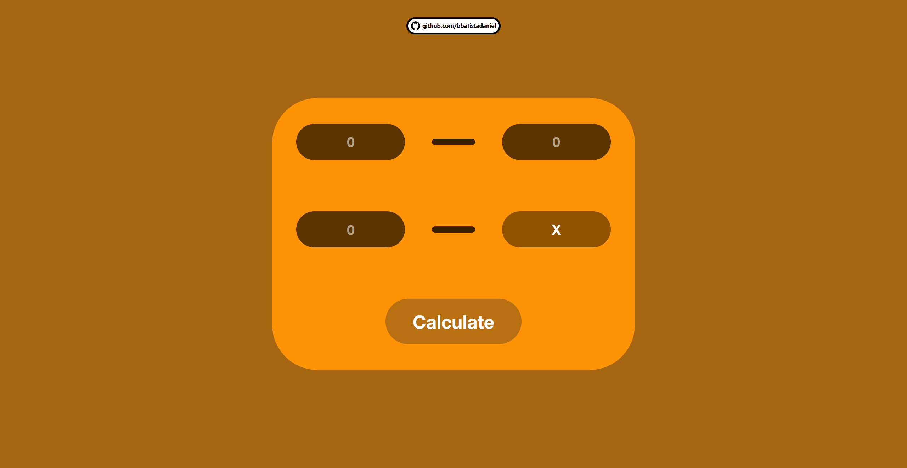
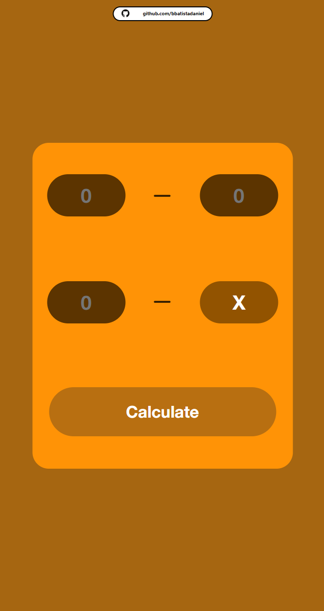

# Rule of Three Calculator

Rule of Three Calculator is a simple web application that allows users to calculate proportions using the rule of three method. Users can input three values and calculate the fourth based on the rule of three formula.

## Features

- **Input Fields:** Three input fields allow users to input numerical values for the known quantities.
  
- **Calculate Button:** Clicking the "Calculate" button computes the fourth value based on the rule of three formula and displays it.

- **Copy Result:** Users can copy the calculated result to the clipboard by clicking the result field.

- **Mobile Optimization:** Most resolutions supported without distortion.

## How to Use

1. **Input Fields:** Enter numerical values for the known quantities in the input fields.
   
2. **Calculate Button:** Click the "Calculate" button to compute the fourth value based on the rule of three formula.
   
3. **Copy Result:** Click the result field to copy the calculated result to the clipboard.

## Project Structure

- **HTML (index.html):** Defines the structure of the rule of three calculator web page with input fields and buttons.
  
- **CSS (style.css):** Styles the HTML elements for a visually appealing and responsive user interface.
  
- **JavaScript (script.js):** Implements the logic for calculating proportions using the rule of three method and copying results to the clipboard.

## Requirements

- Web browser

## Usage

1. Clone or download the repository to your local machine.
  
2. Open the `index.html` file in a web browser.

## Screenshots

## License

This project is open-source and is available under the [MIT License](LICENSE). Feel free to use and modify the code as needed.

## Testing

To experience this project, you can visit the following link: [Rule of Three Calculator](https://bbatistadaniel.github.io/RuleOfThreeCalculator/)
